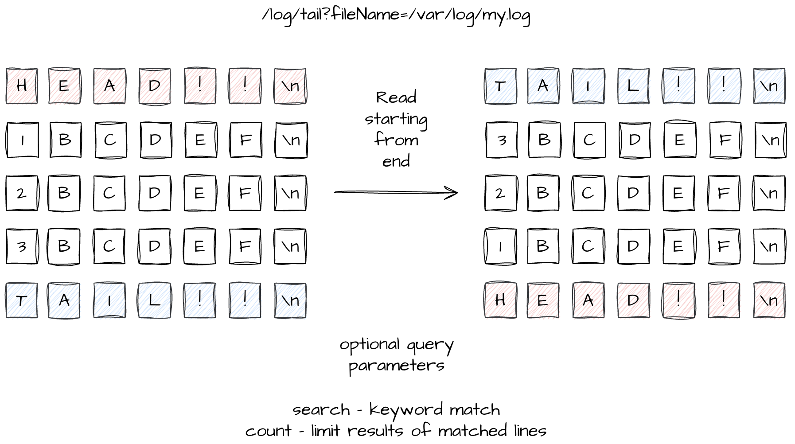

# Log Viewer Agent

Streams data from tail of log towards the beginning. Limits memory footprint by piping data through chunking.
Handles backpressure (client slow) and draining (to resume) during piping.




### Instructions
- Clone repo

- cmd: make init

- cmd: make dev-agent (to run inside docker container)

- cmd: make test (to run unit/integration tests)


```txt
Examples:

curl "http://localhost:3000/log/tail?fileName=test/test_1mb.log&search=777"
curl "http://localhost:3000/log/tail?fileName=test/test_1mb.log&search=777&count=5"
```


### Config
src/runtime.json


- allowed_log_locations:

- read_buffer_bytes_size: read bytes chunk, default(65536)

- default_line_delimiter: default(\n)

- secondaryServerUrls: additional servers to proxy request to


### Requirements
Node, Docker


### Tested on
Mac, Ubuntu

